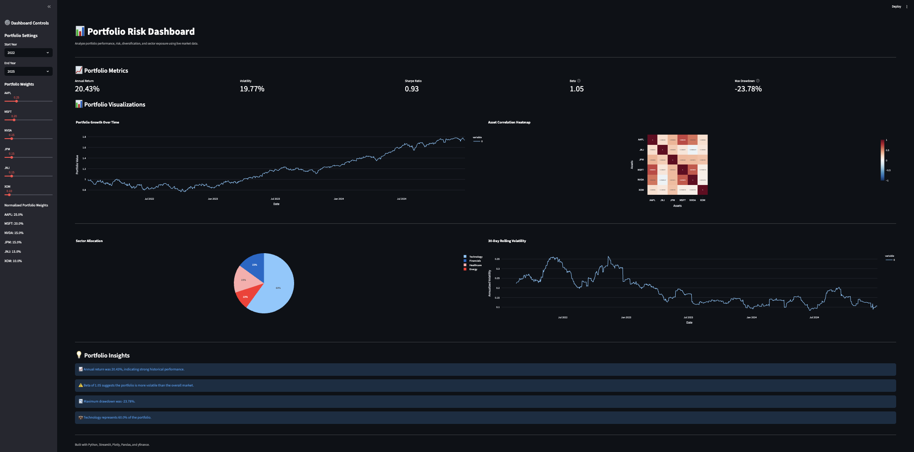

# 📊 Portfolio Risk Dashboard

An interactive financial analytics dashboard built with **Python**, **Streamlit**, **Plotly**, and **yfinance** for analyzing portfolio performance, risk, diversification, and sector exposure using historical market data.

This project demonstrates software engineering, financial analytics, and data visualization by allowing users to explore portfolio performance through interactive charts and professional risk metrics.

> 🚧 **Project Status:** Version 1.0 (Actively Under Development)

---

## 🚀 Features

### 📈 Portfolio Performance
- Historical portfolio growth visualization
- Annualized return calculation
- Customizable analysis date range
- Interactive portfolio weight adjustments

### ⚠️ Risk Analysis
- Annualized volatility
- Sharpe Ratio
- Beta relative to the S&P 500 (SPY)
- Maximum Drawdown
- Rolling 30-Day Volatility

### 📊 Diversification
- Correlation heatmap
- Sector allocation pie chart
- Automatic portfolio weight normalization

### 💡 Portfolio Insights
Automatically generated insights summarize:

- Portfolio performance
- Portfolio risk
- Market sensitivity
- Sector concentration

---

## 🖼 Dashboard Preview



---

## 🛠 Technologies Used

- Python
- Streamlit
- Plotly
- Pandas
- NumPy
- yfinance

---

## 📂 Project Structure

```text
Portfolio-Risk-Dashboard/

├── images/
│   └── dashboard.png
│
├── src/
│   ├── dashboard.py
│   ├── calculations.py
│   ├── charts.py
│   ├── data_loader.py
│   ├── insights.py
│   └── risk_metrics.py
│
├── requirements.txt
├── README.md
├── LICENSE
└── .gitignore
```

---

## ⚙️ Installation

Clone the repository

```bash
git clone https://github.com/sreedatree/Portfolio-Risk-Dashboard.git
```

Navigate into the project

```bash
cd Portfolio-Risk-Dashboard
```

Install dependencies

```bash
pip install -r requirements.txt
```

Run the dashboard

```bash
streamlit run src/dashboard.py
```

---

## 🎯 Skills Demonstrated

- Python Programming
- Data Analysis
- Financial Analytics
- Data Visualization
- API Integration
- Software Architecture
- Interactive Dashboard Development
- Git & GitHub

---

## 🗺 Roadmap

### ✅ Version 1.0 (Current)

- Fixed demonstration portfolio
- Interactive portfolio weight adjustments
- Historical portfolio performance
- Annualized return
- Volatility
- Sharpe Ratio
- Beta
- Maximum Drawdown
- Rolling Volatility
- Correlation Heatmap
- Sector Allocation
- Portfolio Insights
- Streamlit dashboard
- GitHub repository
- Documentation

---

### 🚧 Version 2.0

#### Custom Portfolio Builder

- User-entered stock tickers
- Dynamic portfolio weight sliders
- Automatic portfolio weight normalization
- Automatic sector detection using yfinance
- Portfolio validation
- Better sidebar controls

#### Dashboard Improvements

- Better dashboard layout
- Improved responsiveness
- Better chart styling
- Enhanced portfolio insights

---

### 🚧 Version 3.0

#### Portfolio Management

- Save portfolios
- Load saved portfolios
- Compare multiple portfolios
- Benchmark against the S&P 500
- Portfolio performance comparison
- Export PDF reports
- Export CSV summaries

---

### 🚀 Version 4.0

#### AI Portfolio Assistant

- AI-generated portfolio analysis
- Natural language portfolio summaries
- Portfolio optimization suggestions
- Risk explanation assistant
- Chat with your portfolio
- Investment insight generation

---

## 💡 Future Ideas

- Dark Mode
- International stocks
- Cryptocurrency support
- ETF support
- Dividend analysis
- Portfolio rebalancing suggestions
- Monte Carlo simulations
- Value at Risk (VaR)
- Efficient Frontier optimization

---

## 📄 License

This project is licensed under the MIT License.